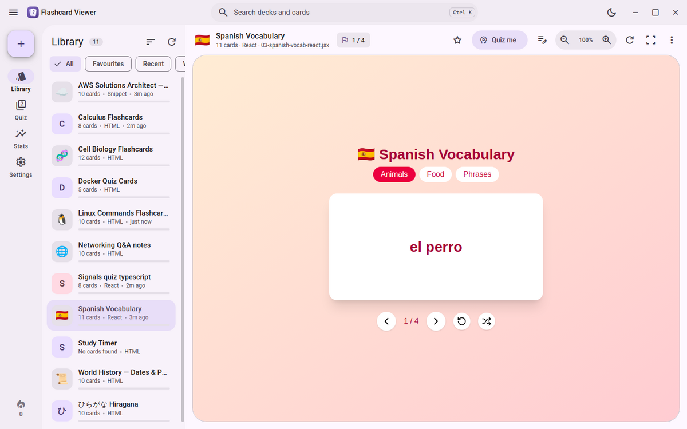
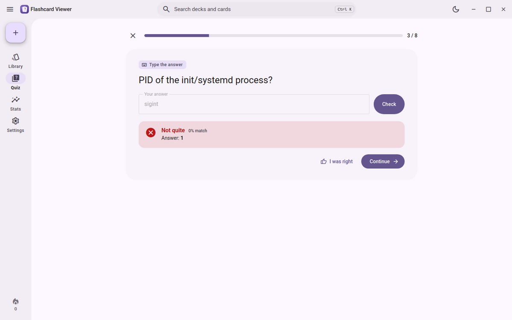
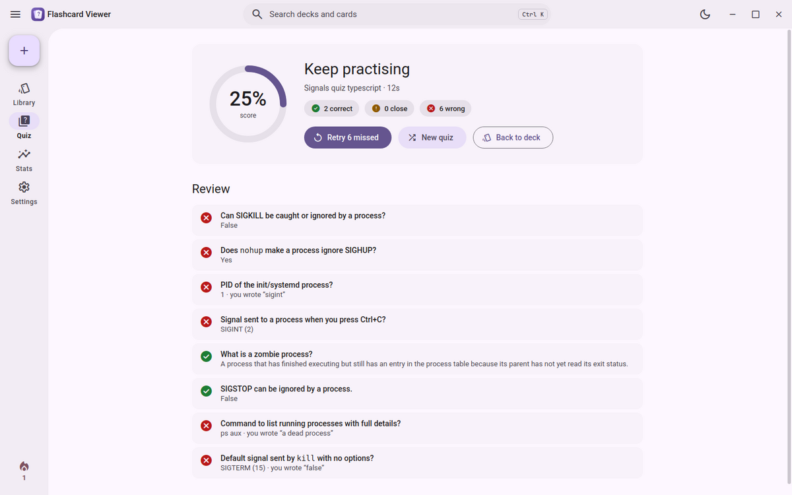
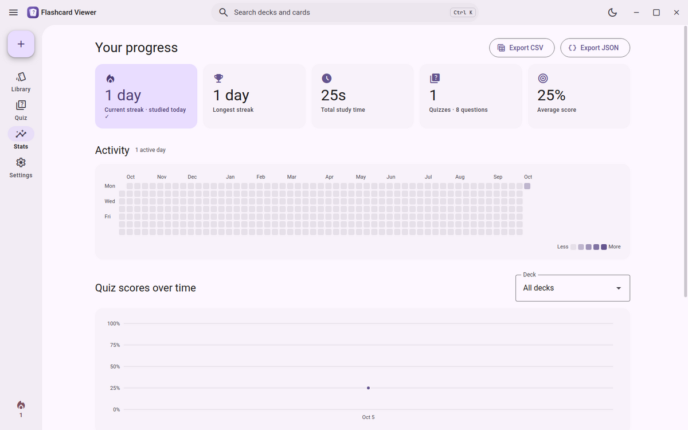
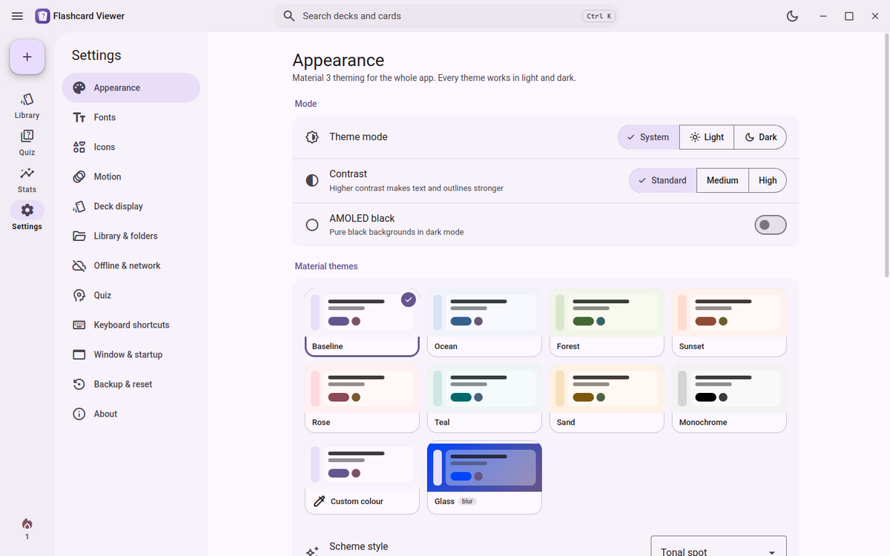
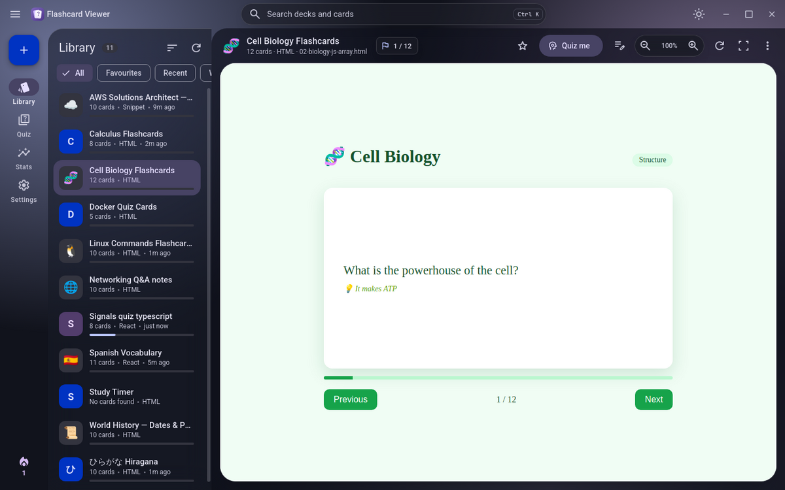
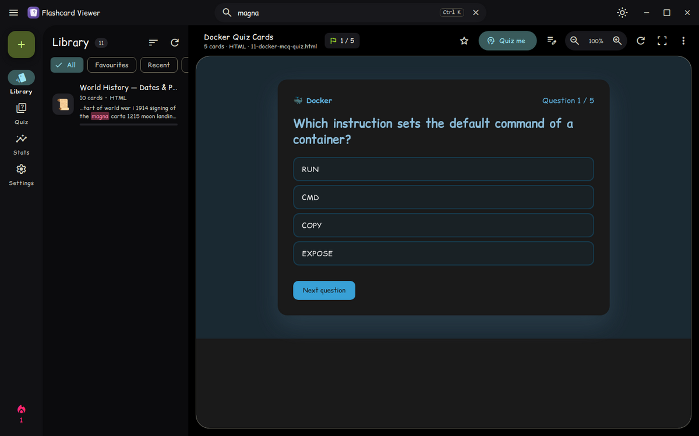
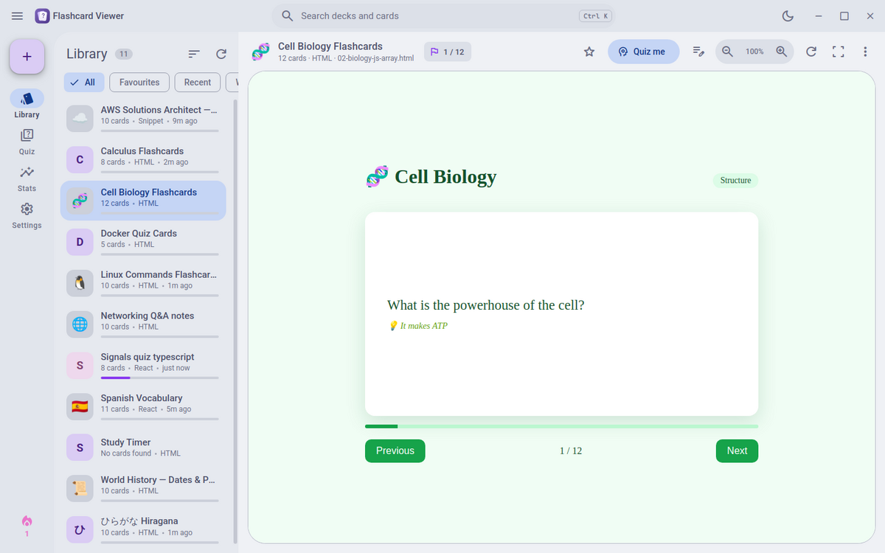
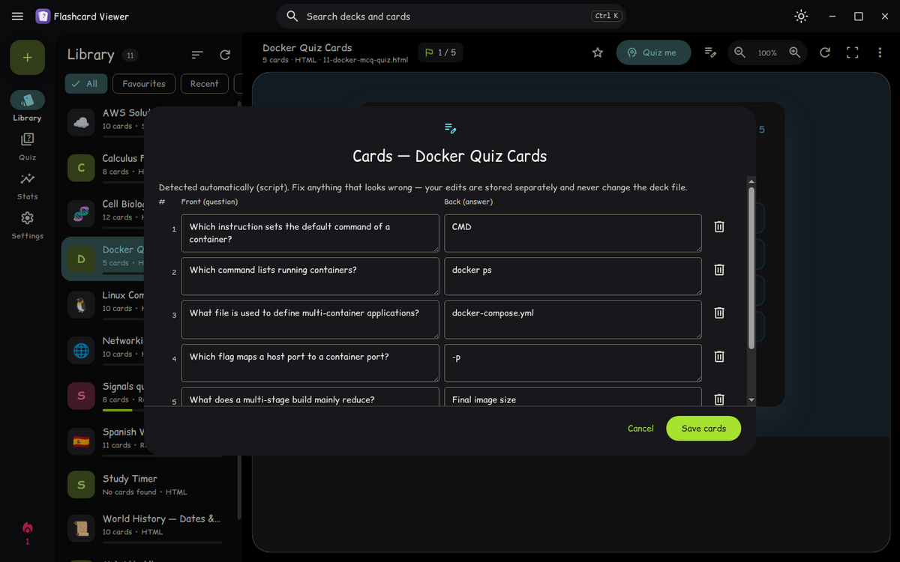

# Flashcard Viewer

A Linux desktop app for studying AI-generated HTML flashcard decks (artifacts),
so you don't need to open them in a browser. It has a Material 3 interface, with popular
themes, quizzes graded by similarity, and progress tracking.



## Features

**Viewing decks**
- Renders AI-generated flashcard artifacts as they are: full HTML pages, HTML **fragments** and **React `.jsx` / `.tsx`**
  components. React, Tailwind, lucide icons and Babel are bundled, and imports that only exist in the original artifact
  environment, such as shadcn/ui and framer-motion, get lightweight stand-ins.
- **Watched folders.** Every `.html`, `.htm`, `.jsx` and `.tsx` file in them shows up automatically.
- **Drag & drop** files onto the window to add them. **“Open with → Flashcard Viewer”** works from your file manager.
- **Auto-reload** when a deck file changes on disk.
- **Search** deck names *and* card content, with accent-insensitive matching (“pina” finds “piña”).
- **Favourites**, recent decks, renaming, and sorting by name, recently opened, recently modified, most studied or least mastered.
- **Focus / fullscreen mode** (F11), per-deck zoom (Ctrl +/−), and progress shown from the deck’s own “3 / 12” counter.
- **Offline-first.** Decks that load Tailwind, fonts or KaTeX from a CDN are cached the first time and then work without internet.
- Optional **app font** and **light/dark matching** inside decks.

**Quiz & tracking**
- When you reach the end of a deck, the app offers a **quiz**. You can also start one any time with **Quiz me** (Ctrl+Q).
- Questions **mix types per card**:
  - typed answers for terms, commands and numbers
  - multiple choice for long answers, with distractors taken from other cards
  - true/false for yes/no cards, or for checking whether a shown answer is right
- **Similarity grading, no ML.** It combines typo-tolerant edit distance with fuzzy keyword overlap and light stemming,
  and it ignores case, punctuation, filler words and (optionally) accents.
  - Parenthetical and slash alternatives count: `SIGTERM (15)` accepts “sigterm” or “15”.
  - Guards make sure numbers, negations and roman numerals actually match: “port 23”, “is not”, “Elizabeth II”.
  - Results are **Correct / Close / Wrong**, with an adjustable strictness slider and an **“I was right”** override.
- **Tracker**:
  - study time, quiz history and best scores per deck
  - **weak cards**, with a “quiz only my weak cards” option
  - **daily streak**
  - a GitHub-style **activity heatmap**
  - a score-over-time chart
  - CSV / JSON export
- **Card editor**. If a deck's questions/answers weren't detected perfectly, fix them. Edits are stored separately; deck files are never modified.

**Material 3 look**
- Custom M3 title bar, navigation rail, Material Web components and **Material Symbols** icons (outlined / rounded / sharp, fill and weight).
- Themes:
  - **Material** palettes generated from a seed colour (Baseline, Ocean, Forest, Sunset, Rose, Teal, Sand, Monochrome), plus any custom colour with 9 scheme styles
  - **Catppuccin** (Latte / Frappé / Macchiato / Mocha, 14 accents), **Gruvbox** (soft/medium/hard), **Monokai**, **Monokai Pro**, **Nord**, **Dracula**, **Tokyo Night**, **Rosé Pine** (+ Moon), **Solarized** and **Everforest**
  - **Glass**: frosted translucent panels, which also work as an effect on top of any theme
- Light / dark / follow system, **AMOLED black**, and standard / medium / high **contrast**.
- Bundled fonts: Roboto Flex, Roboto, Inter, Outfit, Lexend, Atkinson Hyperlegible, Comic Relief, **Maple Mono**, **Comic Mono**. Any installed **system font** can be used too.
- Settings for corner roundness, interface scale, density, text size, animation speed, reduce motion and ripples.
- Fully **customisable keyboard shortcuts**, with a cheat sheet (Ctrl+/).
- **Backup & restore** (settings, favourites, card edits and stats in one zip) and reset options.

| | |
|---|---|
|  |  |
|  |  |
|  |  |
|  |  |

## Install

You need Python 3.9 or newer. The install works on any distro (Ubuntu/Debian/Mint, Fedora, Arch, …), on X11 and Wayland.

```bash
git clone https://github.com/Naved124/flashcard-viewer.git
cd flashcard-viewer
./install.sh
```

`install.sh` installs everything for your user only, with no root needed:

1. It creates a virtual environment in `~/.local/share/flashcard-viewer/venv` and installs PyQt6 and Qt WebEngine (about 200 MB the first time).
2. It adds a `flashcard-viewer` launcher in `~/.local/bin`.
3. It adds an **app-menu entry** with an icon, and registers the app for **“Open with”** on HTML files. This doesn't change your default browser.

If Qt complains about missing libraries, `./install.sh --system-deps` prints the distro packages to install
(on Ubuntu, usually `libxcb-cursor0`).

To remove the app, run `./uninstall.sh`. Your settings and stats are kept unless you add `--purge`, and your deck files are never touched.

**To run from source instead:**

```bash
pip install -r requirements.txt
python3 -m flashcard_viewer            # or: python3 -m flashcard_viewer some-deck.html
```

## Using it

1. Put your flashcard files in `~/Flashcards`, or drop them on the window. You can watch more folders from
   **Settings → Library & folders**.
2. Click a deck to study it. Its own buttons and keyboard controls work as they would in a browser.
3. When you reach the last card, or press **Quiz me**, take a quiz. Wrong answers feed the **weak cards** list.
4. Check **Stats** for your streak, heatmap and scores.

If the quiz finds no cards in a deck, open it and click the **edit cards** button (📝) to add them.

### Default shortcuts

| Action | Keys | Action | Keys |
|---|---|---|---|
| Search | Ctrl+K | Quiz the open deck | Ctrl+Q |
| Add decks | Ctrl+O | Fullscreen focus mode | F11 |
| Next / previous deck | Ctrl+↓ / Ctrl+↑ | Focus mode (keep window) | Ctrl+Shift+F |
| Zoom deck | Ctrl+= / Ctrl+- / Ctrl+0 | Reload deck | Ctrl+R |
| Favourite | Ctrl+D | Show/hide deck list | Ctrl+B |
| Library / Quiz / Stats | Ctrl+1 / 2 / 3 | Settings | Ctrl+, |
| Cheat sheet | Ctrl+/ | Quiz answers | A–D / 1–4, T / F, H = hint, Enter = continue |

All of these can be changed in **Settings → Keyboard shortcuts**, and they work even while a deck has keyboard focus.

## How it finds questions and answers

AI-made decks have no fixed format, so `flashcard_viewer/extract.py` tries several strategies:

- **Script data**: arrays of objects in `<script>` blocks, or anywhere in a `.jsx`/`.tsx` file. A tolerant JavaScript-literal
  parser (`jsparse.py`) handles unquoted keys, all three quote styles, template literals, comments, trailing commas
  and unknown expressions. It recognises key pairs like `question/answer`, `q/a`, `front/back` and `term/definition`,
  and quiz formats like `options` + `correct` index or letter. When the keys are unfamiliar (e.g. `{spanish, english}`),
  it falls back to the first two text fields.
- **DOM structure**: `.front`/`.back`-style class pairs, `data-front`/`data-back` attributes, `<details>/<summary>`,
  `<dl>` lists and 2-column tables.
- **Plain text**: `Q: … / A: …` lines and `term — definition` lists.

`samples/` has 11 decks covering these shapes plus edge cases (BOM/CRLF, unicode filenames, malformed HTML,
a deck with no cards). See [`samples/README.md`](samples/README.md).

## Where things are stored

| What | Where |
|---|---|
| Settings | `~/.config/flashcard-viewer/settings.json` |
| Stats (SQLite), favourites, card edits | `~/.local/share/flashcard-viewer/` |
| Offline CDN cache | `~/.cache/flashcard-viewer/cdn/` |

## Development

```bash
pip install -e '.[dev]'
pytest                                        # extraction, grading, quiz, stats and library tests
FLASHCARD_VIEWER_DEBUG=1 python3 -m flashcard_viewer   # prints JS console messages, enables right-click inspect
```

- `tools/ui_driver.py` drives the real app headlessly (`xvfb-run`) from a JSON list of steps and saves screenshots.
  This is how the screenshots above were made.
- The bundled web assets in `flashcard_viewer/ui/vendor/` are built by `tools/vendor-build/build.mjs`
  (`cd tools/vendor-build && npm install && node build.mjs`).

**Architecture.** A PyQt6 window hosts a single Qt WebEngine view.
- The interface (`flashcard_viewer/ui/`) is plain JavaScript modules plus Material Web components. It talks to Python
  (`bridge.py`) over QWebChannel.
- Decks are served from a `deck://<id>/` scheme, so each deck is its own origin. Each one gets a small helper script
  that reports progress, forwards shortcuts and applies the font/theme options.
- CDN resources go through a `cdn://` scheme backed by the disk cache.

## Licenses

The app code is MIT. The bundled third-party assets keep their own licenses: Material Web, Material Color Utilities
and Material Symbols are Apache 2.0, the fonts are SIL OFL 1.1, Comic Mono is MIT, and React, lucide and Tailwind are MIT/ISC.
See `flashcard_viewer/ui/vendor/THIRD_PARTY_NOTICES.txt`.
