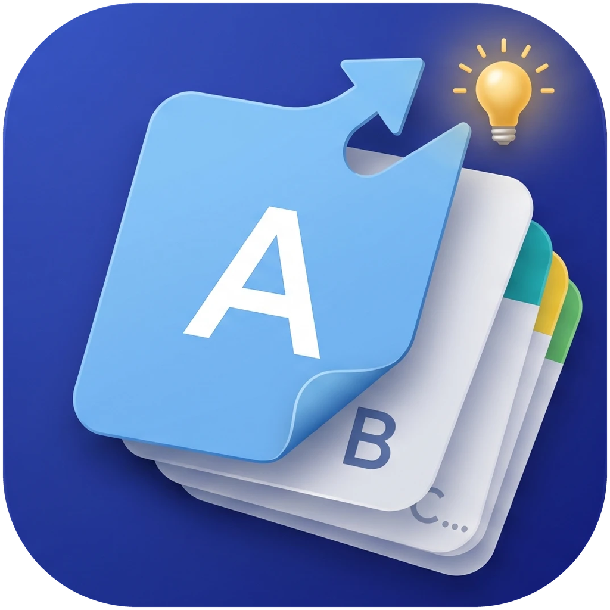
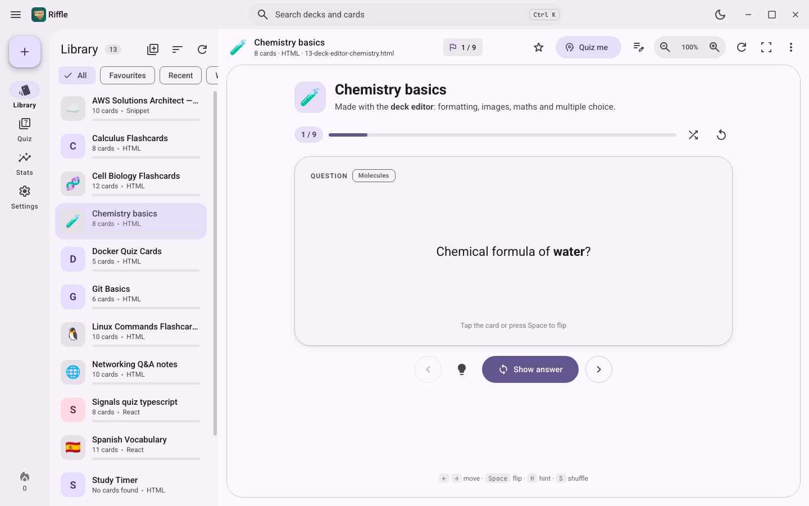

# Riffle

A flashcard app for **Windows, Android and Linux**. Study HTML and React flashcard decks (such as ones made by AI
assistants) without a browser, quiz yourself on them, track your progress, or make your own decks.

<a href="https://apps.microsoft.com/detail/9NS2LGV72W04"></a>



## Features

- **Opens any flashcard deck**: HTML pages, HTML fragments and React `.jsx` / `.tsx` files. Add them by dropping them on
  the window, from watched folders, or with "Open with → Riffle".
- **Quizzes** with typed, multiple-choice and true/false questions. Typed answers are graded by similarity, so small
  typos still count.
- **Progress tracking**: study time, scores, weak cards, a daily streak and an activity heatmap.
- **Deck editor**: make your own decks with flip cards and multiple-choice cards, formatting, images and LaTeX maths.
  Import cards from CSV (including Anki and Quizlet exports).
- **Material 3 design** with many themes (Material, Catppuccin, Gruvbox, Nord, Dracula, Tokyo Night and more),
  light/dark mode, custom fonts and keyboard shortcuts.
- **Works offline** and keeps everything on your device.

## Download

Get the latest version from the [releases page](https://github.com/Naved124/Riffle/releases/latest):

| Platform | File |
|---|---|
| Windows 10/11 | [Microsoft Store](https://apps.microsoft.com/detail/9NS2LGV72W04) (easiest, updates automatically), or `Riffle-Setup-<version>.exe`. If SmartScreen warns, choose **More info → Run anyway**. |
| Android 8.0+ | `Riffle-<version>.apk`. Allow "Install unknown apps" for your browser or file manager. |
| Linux | Install from source (below). |

Riffle checks for updates by itself and asks before installing them (**Settings → About**).

### Linux

Needs Python 3.9 or newer.

```bash
git clone https://github.com/Naved124/Riffle.git
cd Riffle
./install.sh
```

This adds Riffle to your app menu. To remove it, run `./uninstall.sh`.

## Getting started

1. Put your flashcard files in `~/Flashcards` (on Android, tap **+**), or drop them on the window.
2. Click a deck to study it.
3. Press **Quiz me** to test yourself, and check **Stats** for your progress.
4. To make your own deck, click **Create a deck** above the deck list (Ctrl+N).

Press **Ctrl+/** to see all keyboard shortcuts.

## License

Riffle is free to download and use, but it is not open source. © 2026 Naved124. You may share it and package it
for package managers free of charge, but not sell it or change what it does. See [LICENSE](LICENSE). Bug reports and ideas are welcome in
[Issues](https://github.com/Naved124/Riffle/issues).

Riffle collects no personal data; see the [privacy policy](PRIVACY.md).

Bundled third-party components keep their own licenses
(see `flashcard_viewer/ui/vendor/THIRD_PARTY_NOTICES.txt`).
